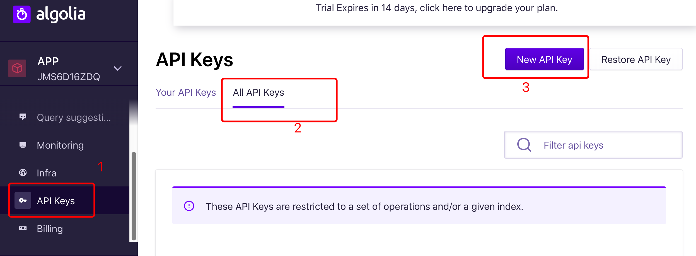
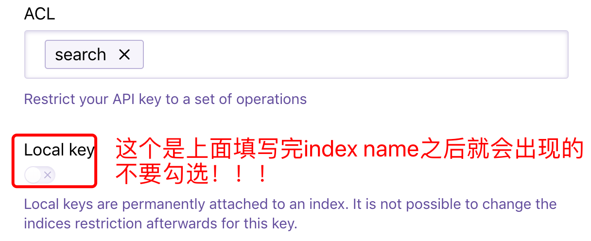
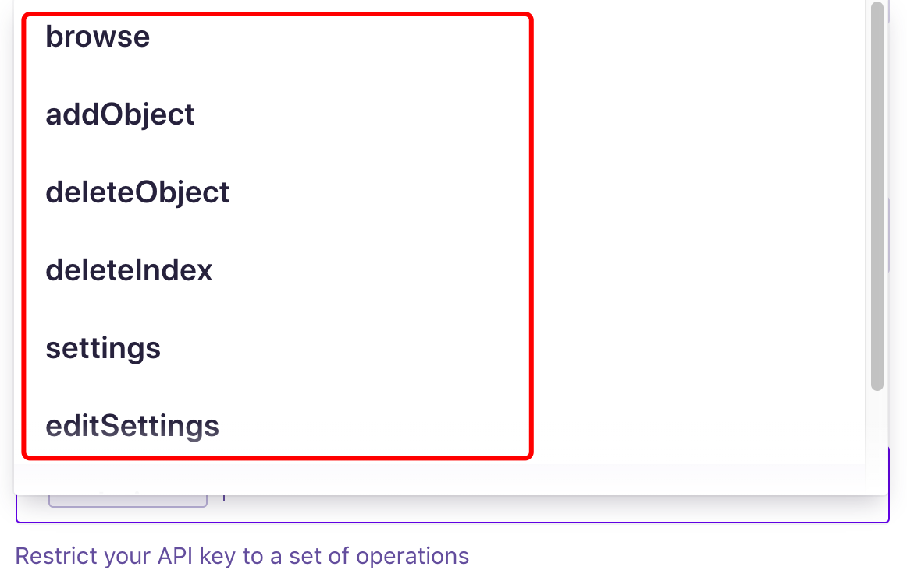

安装butterfly的时候，复制好`butterfly.yml`之后直接把`/themes/Butterfly/_config.yml`删掉即可，还有`/themes/landscape`文件夹也可以删掉


### hexo博客Front-matter模板配置

https://zhangjiejun.com/posts/config_Front-matter_in_hexo/


### 关于Butterfly图片的路径：

在buttergly中的`/img`对应的路径都是`/themes/Butterfly/source/img`


### 每次创建完文章后进行的操作：

```
hexo s // 在本地查看是否达到预期效果，到达后继续执行下面步骤
hexo clean
hexo g
提交到远程仓库（使用github或者命令行）
hexo d
```

还要记得刷新搜索相关的index：

【不然在搜索功能里面会找不到你的文章】

```
export HEXO_ALGOLIA_INDEXING_KEY='6a04d740b5866dec91ed161e1c60efda'
hexo algolia
```


### 使用algolia配置网站的搜索功能时的注意点：

1. 跟着那个[hexo-theme-butterfly安装文档](https://jerryc.me/posts/21cfbf15/#Page-Front-matter)来的时候，到了这一步记得不要安装hexo-algoliasearch这个插件，安装hexo-algolia即可

【如果不小心安装了hexo-algoliasearch也没关系，执行命令卸载即可：`npm un hexo-algoliasearch --save`】

2. 生成API Key的时候，记得要这样做：

- 点击生成



- 创建过程中：



- 然后你点击`ACL`下面的那个长长的文本框，他会自动弹出一个列表给你选的：



注意：此处和网上的不同：网上的是几个小框框给你勾选的；并且此处的`addObject`、`deleteObject`相当于网上的`Add records`、`Delete record` 


### 修改打赏功能的文本

全局搜索“打赏”两个字然后再修改成自己想要的文本即可


# 参考

> [启用-Algolia-搜索](https://github.com/fi3ework/hexo-theme-archer/wiki/启用-Algolia-搜索)
>
> [Hexo+Next集成Algolia搜索](https://juejin.im/post/5af3f9d1518825673e35a6eb)
>
> 