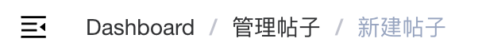
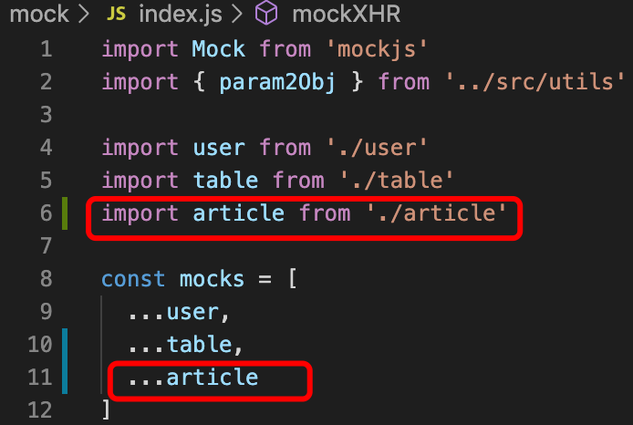
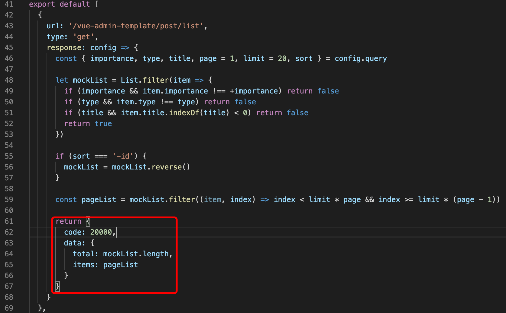
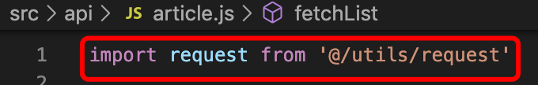
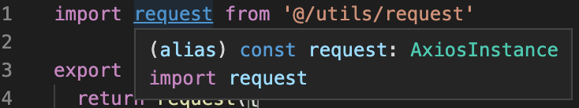

# 比较关键的一些文件路径

```
├── build                      // 构建相关  
├── config                     // 配置相关
├── src                        // 源代码
│   ├── api                    // 所有请求
│   ├── assets                 // 主题 字体等静态资源
│   ├── components             // 全局公用组件
│   ├── directive              // 全局指令
│   ├── filtres                // 全局 filter
│   ├── icons                  // 项目所有 svg icons
│   ├── lang                   // 国际化 language
│   ├── mock                   // 项目mock 模拟数据
│   ├── router                 // 路由
│   ├── store                  // 全局 store管理
│   ├── styles                 // 全局样式
│   ├── utils                  // 全局公用方法
│   ├── vendor                 // 公用vendor
│   ├── views                   // view
│   ├── App.vue                // 入口页面
│   ├── main.js                // 入口 加载组件 初始化等
│   └── permission.js          // 权限管理
├── static                     // 第三方不打包资源
│   └── Tinymce                // 富文本
├── .babelrc                   // babel-loader 配置
├── eslintrc.js                // eslint 配置项
├── .gitignore                 // git 忽略项
├── favicon.ico                // favicon图标
├── index.html                 // html模板
└── package.json               // package.json
```

1. view和api一般都是一一对应的，view是模块，api中则存放view中使用到的请求函数


# 关于侧边栏的配置

> [ 路由和侧边栏](https://panjiachen.github.io/vue-element-admin-site/zh/guide/essentials/router-and-nav.html#配置项)

面包屑导航指的是这一块：



# 关于mock造数据

1. 在`api/xxx.js`中编写你的request函数（此处假设其中请求的url的值为`req_url`）
2. 然后需要在`mock/xxx.js`中针对`req_url`返回一些数据
3. 最后需要在index.js中注册你的接口文件，如在接入article相关数据请求时：



# 使用vue-element-admin中的组件

1. vue-element-admin的组件大部分都位于`src/components/`目录下，直接过去复制粘贴到自己的项目对应路径下即可，然后使用的时候记得`import`进来
2. 还有一些组件是需要自己使用`npm`安装的，比较好的方法是直接去`/package.json`文件里面写好的自己缺的组件，然后执行`npm install`即可

# 遇到的小问题

1. 关于mock出来的数据都中的`response.data.item`

mock数据返回的JSON包是在`./mock/xxx.js`中定义的，故我们去看对应的生成函数即可......

举个🌰：【其中的`code`、`data`相当于一个JSON包中的key】



2. 之所以这里能将当作一个axios实例来使用似乎是因为使用了alias：





