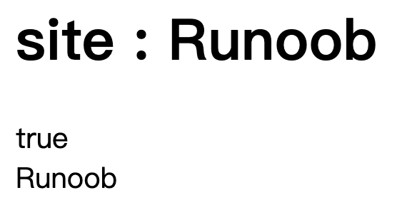
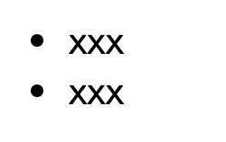
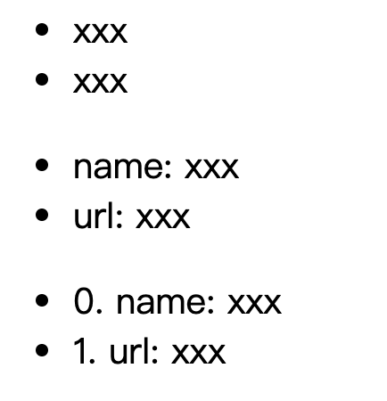
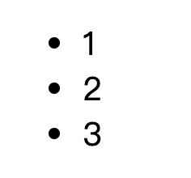

# 导入、创建组件

1. 导入已写好的组件`Hello`，并创建一个新的组件`app`

```javascript
<template>
  <div id="app">
    
    <hello></hello>
  </div>
</template>

<script>
// 导入组件
import Hello from './components/Hello'
 
export default {
  name: 'app',
  components: {
    Hello
  }
}
</script>
```

2. 当一个 Vue 实例被创建时，它向 Vue 的响应式系统中加入了其 data 对象中能找到的所有的属性。当这些属性的值发生改变时，html 视图将也会产生相应的变化

```javascript
<!DOCTYPE html>
<html>
<head>
	<meta charset="utf-8">
	<script src="https://cdn.staticfile.org/vue/2.4.2/vue.min.js"></script>
</head>
<body>
    <div id="vue_det">
        <h1>site : {{site}}</h1>
    </div>
    <script type="text/javascript">
    // 我们的数据对象
    var data = { site: "菜鸟教程"}
    var vm = new Vue({
        el: '#vue_det',
        data: data
    })
    // 它们引用相同的对象！
    document.write(vm.site === data.site) // true
		document.write("<br>")
    // 设置属性也会影响到原始数据
    vm.site = "Runoob"
    document.write(data.site + "<br>") // Runoob
    </script>
</body>
</html>
```

运行结果：



# 常用指令

1. `v-bind`
2. `v-on`
3. `v-if`、`v-else-if`、`v-else`
4. `v-model`
5. `v-show`：根据条件展示元素
6. `v-for`：循环语句

- 遍历数组：`v-for="obj in object"`，Eg:

```javascript
<div id="app">
  <ul>
    <li v-for="site in sites">
      {{ site.name }}
    </li>
  </ul>
</div>

<script>
new Vue({
  el: '#app',
  data: {
    sites: [
      { name: 'xxx' },
      { name: 'xxx' }
    ]
  }
})
</script>
```

运行结果:



- 遍历对象：`v-for="obj in object"` / `v-for="(value, key) in object"` / `v-for="(value, key, index) in object"`，Eg：

```javascript
<div id="app">
  <ul>
    <li v-for="value in object">
    {{ value }}
    </li>
  </ul>

	<ul>
    <li v-for="(value, key) in object">
      {{ key }}: {{ value }}
    </li>
  </ul>

	<ul>
    <li v-for="(value, key, index) in object">
      {{ index }}. {{ key }}: {{ value }}
    </li>
  </ul>
</div>
 
<script>
new Vue({
  el: '#app',
  data: {
    object: {
      name: 'xxx',
      url: 'xxx'
    }
  }
})
</script>
```

运行结果：



- 遍历整数：`v-for="n in 3"`，Eg：

```javascript
<div id="app">
  <ul>
    <li v-for="n in 3">
     {{ n }}
    </li>
  </ul>
</div>

<script>
new Vue({
  el: '#app'
})
</script>
```

运行结果：



# Vue 将后台传过来的 带html字段的字符串 转换为 HTML

> [Vue 将后台传过来的 带html字段的字符串 转换为 HTML](https://blog.csdn.net/u012302552/article/details/79738144)

使用`v-html`

v-html可以操作元素中的HTML标签，效果类似于jquery里的 .html()方法，在不安全的页面比如注册或者登陆页面千万不要用这个指令。因为会出现XSS攻击。所以千万不要用。

官网提示：

> 在不安全的页面比如注册或者登陆页面千万不要用这个指令。因为会出现 XSS攻击。所以千万不要用。

# 关于axios

> [axios的使用](https://harry0071.github.io/2018/04/14/axios的使用/)
>
> [Aixos中文文档](https://www.kancloud.cn/yunye/axios/234845)
>
> [使用axios時你的api都怎麼管理]([https://medium.com/i-am-mike/%E4%BD%BF%E7%94%A8axios%E6%99%82%E4%BD%A0%E7%9A%84api%E9%83%BD%E6%80%8E%E9%BA%BC%E7%AE%A1%E7%90%86-557d88365619](https://medium.com/i-am-mike/使用axios時你的api都怎麼管理-557d88365619))

# 遇到的问题

1. vue使用`v-for`时vscode报错`Elements in iteration expect to have 'v-bind:key' directives`

> [vue使用v-for时vscode报错 Elements in iteration expect to have 'v-bind:key' directives](https://www.cnblogs.com/zdz8207/p/vue-for-v-bind-key.html)

解决办法：在`v-for` 后添加`:key='item'`

2. `avoid using non-primitive value as key, use string/number value instead.`

原因就是`:key`不能赋值为数组，只能是字符串或者数字。

【这个key相当于索引？大概是为来更方便遍历整个数组】

3. 如何渲染v-html内文本

> [有作用域的 CSS](https://vue-loader-v14.vuejs.org/zh-cn/features/scoped-css.html)
>
> [vue v-html v-text渲染富文本时的样式修改问题](https://blog.csdn.net/qq_41241767/article/details/90447167)

- 去掉scoped：

当标签有 `scoped` 属性时，它的 CSS 只作用于当前组件中的元素。这类似于 Shadow DOM 中的样式封装。它有一些注意事项，但不需要任何 polyfill。它通过使用 PostCSS 来实现以下转换：

