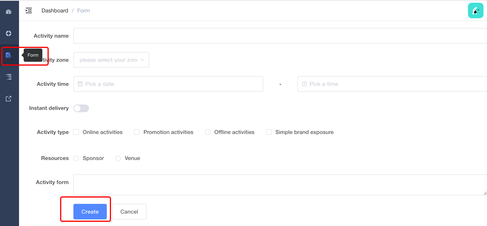

## 1. 前端的配置（基于[vue-admin-template](https://github.com/PanJiaChen/vue-admin-template)项目进行改造）

- ### **/vue.config.js**：

将前端项目中带有 `/dev-api`的域名请求，全都重定向到后端的域名中（此处即http://127.0.0.1:8000）

```javascript
module.exports = {
  ...
  
  devServer: {
    port: 9528,
    open: true,
    overlay: {
      warnings: false,
      errors: true
    },
    before: require('./mock/mock-server.js'),

    proxy: {
      '/dev-api': {
        target: 'http://127.0.0.1:8000', // 此处的后台地址暂时使用本地地址进行模拟
        changeOrigin: true, // 允许跨域
        pathRewrite: { '^/dev-api': '/' } // 匹配到'/dev-api'，就变成''
      }
    }
  },
  
  ...
}
```


在[vue-admin-template](https://github.com/PanJiaChen/vue-admin-template)项目中，一般用于请求数据的api的实现都放到了`src/api/xxx.js`中，此处实现了一个获取后端数据的例子：

【值得注意的是，此项目中自己分装了request函数用于方便生成一个axios对象】

/src/utils/request.js

```javascript
// create an axios instance
const service = axios.create({
  baseURL: process.env.VUE_APP_BASE_API, // url = base url + request url
  // withCredentials: true, // send cookies when cross-domain requests
  timeout: 5000 // request timeout
})

// request interceptor
service.interceptors.request.use(
  config => {
    // do something before request is sent

    if (store.getters.token) {
      // let each request carry token
      // ['X-Token'] is a custom headers key
      // please modify it according to the actual situation
      config.headers['X-Token'] = getToken()
    }
    return config
  },
  error => {
    // do something with request error
    console.log(error) // for debug
    return Promise.reject(error)
  }
)
```

此处的`VUE_APP_BASE_API`在`/.env.development`文件中定义: `VUE_APP_BASE_API = '/dev-api'`


- ### **/src /api /test.js**

`qshTest()`函数负责请求后端数据

```javascript
import request from '@/utils/request'

export function qshTest(query) {
  return request({
    url: '/test/',
    method: 'get',
    params: query
  })
}
```


`qshTest()` 函数调用的时机选在了点击From页面下的create按钮时，如图：




- ### **/src /view /index.vue**

修改了其中的 `onSubmit()` 函数:

```javascript
import { qshTest } from '@/api/test'
export default {
	...

  methods: {
    onSubmit() {
      qshTest().then(response => {
        console.log(response.data)
      })
      this.$message('submit!')
    },
    ...
  }
}
```


## 2. 后端的配置（此处后端使用的是Python+Django）

- ### **CORS配置**:

  - 安装**django-cors-middleware** (速度慢可以自己找清华镜像) ：`pip install django-cors-middleware`
  - **setteings.py**

```python
INSTALLED_APPS = [
  	...
    'corsheaders',  # CORS配置相关
]

MIDDLEWARE = [
  	...
    # 添加中间件监听
    'corsheaders.middleware.CorsMiddleware',
    'django.middleware.common.CommonMiddleware',
]

# 允许跨域使用cookie
CORS_ALLOW_CREDENTIALS = True

# 配置允许跨域访问的域名(白名单)
CORS_ORIGIN_ALLOW_ALL = False
CORS_ORIGIN_WHITELIST = [
    'google.com',
    'localhost',
    'localhost:9528',
]

# 设置允许访问的方法:
CORS_ALLOW_METHODS = [...]
# 设置允许的header：
CORS_ALLOW_HEADERS = [...]
```

- ### **配置url**

**urls.py**

```python
from blog import views
urlpatterns = [
    ...
    path('test/', views.test),
]
```

- ### **配置视图函数**

**blog/views.py**

```python
from django.http import JsonResponse
def test(request):
    ret = {
        'code': 20000,
        'data': '奥利给！'
    }
    response = JsonResponse(ret)
    response['Access-Control-Allow-Origin'] = '*'
    return response
```


## 参考

> [https://panjiachen.github.io/vue-element-admin-site/zh/guide/essentials/server.html#%E5%89%8D%E7%AB%AF%E8%AF%B7%E6%B1%82%E6%B5%81%E7%A8%8B](https://panjiachen.github.io/vue-element-admin-site/zh/guide/essentials/server.html#前端请求流程)
>
> https://www.sohu.com/a/244645479_727010
>
> https://cli.vuejs.org/zh/config/#devserver-proxy

