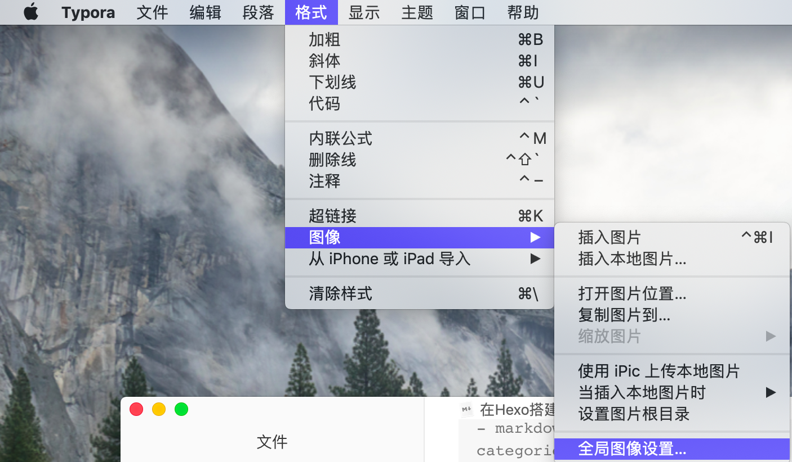
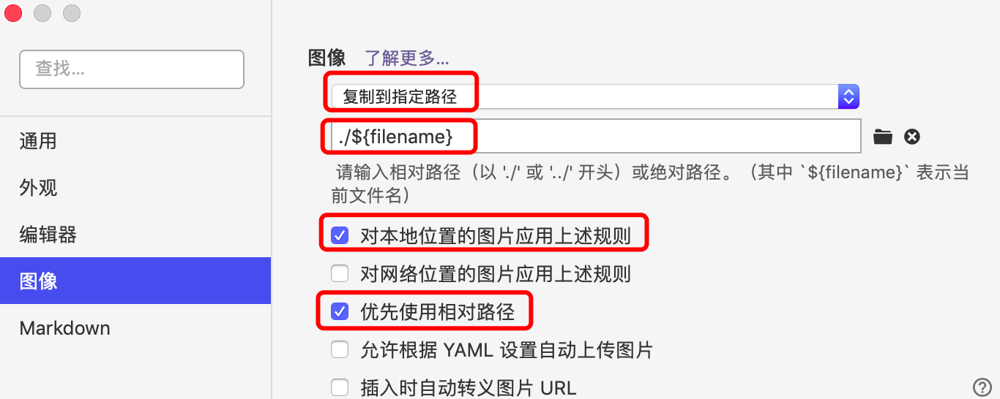
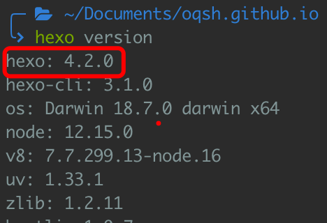

# 工作前提

1. 成功使用Hexo搭建自己的个人博客
2. 电脑已安装Typora的markdown编辑器

【PS：此处只介绍在mac OS下是如何操作的，不过windows下应该也是类似的操作】


# 技巧一：快速往markdown中插入图片

## 最终效果

- 可以直接在本地直接在Typora编辑器内直接复制粘贴图片
- 在编辑器内写博客时能即时看到图片
- 配置到自己的博客时也不用再手动改代码或者移动图片


## 1. 修改Typora中插入图片的相关设置

- 首先打开全局图像设置：



- 然后按图中红框标记的设置进行配置：




## 2. 安装hexo-asset-image插件

```
npm install https://github.com/CodeFalling/hexo-asset-image --save --registry=https://registry.npm.taobao.org
```

【PS：命令行末尾添加`--registry=https://registry.npm.taobao.org`是为了让国内的童鞋安装能快一点。如果你已经配置好淘宝的`cnpm`，直接用`cnpm`即可】


## 3. 修改项目根目录下的_config.yml文件

将其中的`post_asset_folder`的值设置为true，如果文件中没有`post_asset_folder`就自己添加下面这句话就好：

```
post_asset_folder: true
```

设置为true的作用是：当你在终端中执行`hexo new xxx_blog`时，

- 不仅会在`/source/_posts/`文件夹下生成`xxx_blog.md`
- 还会在`/source/_posts/`文件夹下生成一个名为`xxx_blog`的文件夹


# 技巧二：添加文章时自动打开markdown编辑器

> 主要参考此文章：[添加文章时自动打开编辑器](https://notes.doublemine.me/2015-06-29-Hexo添加文章时自动打开编辑器.html)，下面示范在mac OS下的操作

## 1. 在项目根目录下的`scripts`文件夹中创建一个xxx.js的文件：

- 如果没有`scripts`文件夹，则自己新建一个
- 新建的xxx.js文件，名字可以任意取

## 2. xxx.js文件的内容：

```javascript
var exec = require('child_process').exec;

// Hexo 2.x 用户复制这段
hexo.on('new', function(path){
    exec('open -a "markdown编辑器绝对路径.app" ' + path);
});
// Hexo 3 用户复制这段
hexo.on('new', function(data){
    exec('open -a "markdown编辑器绝对路径.app" ' + data.path);
});
```

- 查看自己的Hexo版本：
- 打开终端，并移动到自己博客项目根目录下，执行`hexo version`即可：



- 关于markdown编辑器绝对路径如何找，这里就不细说了，自行百度应该问题不大

## 3. 保存并退出xxx.js文件之后即可生效


# 参考

>[hexo中完美插入本地图片](http://etrd.org/2017/01/23/hexo中完美插入本地图片/)
>
>[添加文章时自动打开编辑器](https://notes.doublemine.me/2015-06-29-Hexo添加文章时自动打开编辑器.html)